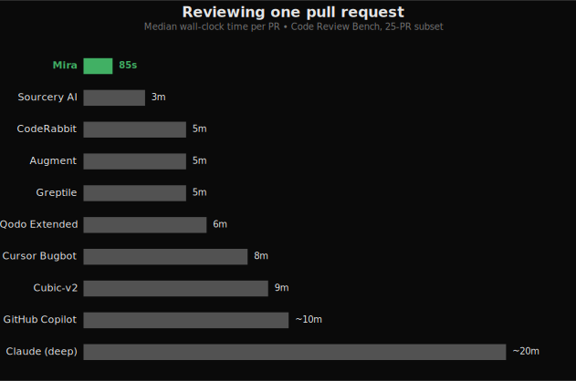
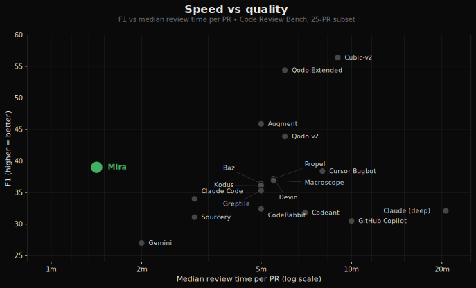

<p align="center">
  
</p>

<h1 align="center">Mira</h1>

<p align="center">
  <strong>Self-hosted AI code review. Your code, your dashboard, your LLM key.</strong>
</p>

<p align="center">
  <a href="https://docs.miracode.ai"></a>
  <a href="https://discord.gg/uEU6qvYhgm"></a>
</p>

<p align="center">
  <a href="https://docs.miracode.ai">Docs</a> ·
  <a href="https://discord.gg/uEU6qvYhgm">Community</a> ·
  <a href="https://docs.miracode.ai/deployment"><strong>Self-Host Guide »</strong></a> ·
  <a href="#benchmark">Benchmark</a>
</p>

Self-host every feature: full review engine, codebase indexing, vulnerability scanning, custom rules, org-wide package search, dashboard, learning loop. No paid tier, no license key, no SaaS upsell.

Mira reviews your pull requests using your choice of LLM (via [OpenRouter](https://openrouter.ai), which fronts Anthropic, OpenAI, Google, DeepSeek, and more) and posts concise, actionable feedback. The noise filter, confidence clamping, and learning loop ensure you only see comments that matter. See [`FEATURES.md`](FEATURES.md) for the full surface.

## Why Teams Choose Mira

- **Model agnostic** — Run Claude, GPT, Gemini, DeepSeek, Llama, or any OpenAI-compatible endpoint: OpenRouter, vLLM, Ollama, Together, Groq, Fireworks, or AWS Bedrock direct. Per-provider quirks are config, not code, so adding a provider is a one-line entry.
- **Zero markup on LLM costs** — Bring your own key. You pay the model provider directly; Mira never proxies your spend or adds a multiplier. The dashboard shows real per-repo, per-model cost — not estimates.
- **Learns from your context** — Mira synthesizes rules from your merged PRs: rejected comments and human review patterns become team rules that shape future reviews.
- **You set the rules** — Define custom and org-wide review rules in plain language, per-repo via `.mira.yaml` or from the dashboard.
- **Privacy first** — Self-hosted by default. Diffs, indexes, review history, and CVE data live in your SQLite or Postgres, on infra you own. No phone-home, no required telemetry, no "is this used for training?"
- **Low-noise reviews** — Confidence thresholds, dedup, a self-critique pass, and per-PR caps mean every comment is one worth reading — and Mira is the fastest tool on the public [Code Review Bench](#benchmark).
- **Indexed, cross-file context** — A full-repo code index gives the model real project context, not just the diff — plus org-wide package search and hourly OSV.dev CVE scanning across every repo.
- **GitHub and GitLab** — Auto-reviews every PR and merge request and answers `@miracodeai` questions inline, with full feature parity across both. Bitbucket and Gitea adapters are next; the engine, indexer, and dashboard are provider-agnostic, so a new host is a data entry plus one provider class.
- **Self-host on day one** — Docker image with Railway / Fly.io / Render configs, SQLite or Postgres. Every feature included.

## Dashboard


## Your data, your dashboard

Most AI reviewers are SaaS: your diffs (and often the full surrounding code) leave for a third-party server, and the only "view" you get is the comments that come back on a PR. Mira flips both halves of that:

- **Your code never leaves your infra.** Diffs, embeddings, indexes, review history, vulnerability data, all stored in your SQLite or Postgres, on infrastructure you own. No phone-home, no required telemetry, no "is this used for training?" question.
- **The dashboard you see above is yours.** It's not a marketing screenshot of someone else's view of your code. CodeRabbit, Greptile, and similar SaaS reviewers don't expose anything like it. Mira's dashboard surfaces signals you don't get anywhere else:
  - **Org-wide package inventory**: answer "which repos use `lodash@4.17.20`?" in one query. Stack it next to your CVE feed for instant blast-radius checks.
  - **CVE alerts on every dependency**: hourly OSV.dev poll, severity + advisory link + fix version surfaced inline next to the package.
  - **Dependency + blast-radius graphs**: see exactly which files and repos depend on a symbol before you change it.
  - **Per-repo review event stream**: every webhook, every chunk, every cost figure, in one place for live troubleshooting.
  - **Cost & token telemetry**: actual spend per repo and per model, not estimates, because you control the LLM key.
  - **Coming soon, change-frequency heatmaps**: surface the files that bug fixes keep landing on so you can target review attention.

If your engineering team needs answers like *"which of our repos are exposed to this CVE?"* or *"what's the blast radius of changing this function?"*, those questions stop being multi-day investigations and start being one-click dashboard pages.

## Benchmark

Mira is **the fastest tool measured** on the public [Code Review Bench](https://codereview.withmartian.com/?mode=offline), and the only one on the speed/quality Pareto frontier: every tool that scores higher on F1 takes **5–14× longer per PR**.



Plotted against every published competitor on the same subset, Mira sits in the upper-left corner: everything to the right is slower; everything above it pays 5–14× the wall time for the extra F1.



Measured on the same 50-PR offline benchmark, judged by Claude Sonnet 4.6.

| | **Mira** | Cubic-v2 | Greptile | CodeRabbit | GitHub Copilot |
|---|---:|---:|---:|---:|---:|
| F1 | **44** | 56 | 35 | 32 | 31 |
| Precision | **43%** | 50% | 32% | 24% | 24% |
| Recall | **46%** | 65% | 40% | 50% | 43% |
| Median time / PR | **~77s** | ~9m | ~5m | ~5m | ~10m |

> Methodology: scores measured against the [Martian Code Review Bench](https://codereview.withmartian.com/?mode=offline) offline dataset with Claude Sonnet 4.6 as the judge.

## Quick Start

Run Mira self-hosted to auto-review every PR and merge request and answer `@miracodeai` questions inline. GitHub (as a GitHub App) and GitLab (via a group/project access token) are both fully supported; Bitbucket and Gitea are next.

**1. Deploy** — one-click on Railway, or with Docker:

[](https://railway.com/workspace/templates/05874bad-2d98-43f4-aa93-332f394e9ebd)

```yaml
# mira.yaml — deployment-wide defaults. Every key is optional.
llm:
  model: "anthropic/claude-sonnet-4-6"
  indexing_model: "anthropic/claude-haiku-4-5"
```

```bash
# .env — secrets only.
MIRA_GITHUB_APP_ID=123456
MIRA_GITHUB_PRIVATE_KEY="$(cat private-key.pem)"
MIRA_WEBHOOK_SECRET=your-secret
OPENROUTER_API_KEY=sk-or-...
```

```bash
docker run -p 8000:8000 --env-file .env \
  -v "$(pwd)/mira.yaml:/app/mira.yaml" \
  ghcr.io/miracodeai/mira:latest --config /app/mira.yaml
```

**2. Install the app** on your repos — every PR gets reviewed.

→ Full walkthrough: [creating the GitHub App & quickstart](https://docs.miracode.ai/quickstart) · [GitLab setup](https://docs.miracode.ai/gitlab) · [deploy options](https://docs.miracode.ai/deployment) · [choosing models, custom endpoints & AWS Bedrock](https://docs.miracode.ai/configuration/models)

## Configuration

`mira.yaml` (loaded via `--config`) holds deployment-wide defaults. Drop a `.mira.yaml` in any repo — or use the dashboard — to override per-repo; both deep-merge over `mira.yaml` for that repo only:

```yaml
# .mira.yaml — optional per-repo override
filter:
  confidence_threshold: 0.5  # noisier repo → lower bar
  max_comments: 10
```

→ Full schema and every key: [Configuration docs](https://docs.miracode.ai/configuration).

## Development

```bash
git clone https://github.com/mira-reviewer/mira.git
cd mira
pip install -e ".[dev,serve]"

# Run tests
pytest tests/ -v

# Run the regression suite (hits real GitHub + LLM, ~$1, ~3 min).
# Pinned PRs whose findings have flickered across iterations. Run before
# merging changes that touch prompts, the noise filter, or the engine.
OPENROUTER_API_KEY=... GITHUB_TOKEN=... pytest -m eval -v

# Lint
ruff check src/ tests/

# Type check
mypy src/mira/ --ignore-missing-imports
```

## License

Apache 2.0. See [LICENSE](LICENSE).
